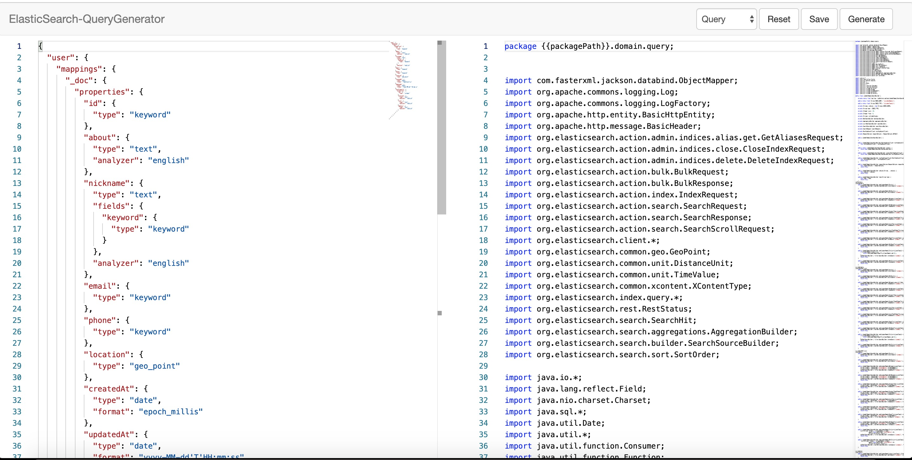

# generator

## Introduction

generator 是一个纯静态html编写的查询生成器,可以快速根据mapping,数据库元数据信息生成项目工具


## 预览




### ElasticSearch Query

前往 [ElasticSearch Query](https://wu191287278.github.io/elasticsearch-query-generator/) 生成代码


#### ElasticSearch Query Getting Started


```java
RestClientBuilder builder = RestClient.builder(new HttpHost("http://localhost", 9200));
RestHighLevelClient restHighLevelClient = new RestHighLevelClient(builder);
SearchResponse searchResponse = UserQueryBuilder.create(restHighLevelClient)
        .page(1,20)
        .columns(UserQueryBuilder.Column.id)
        .andNicknameLike("zhang")
        .andCreatedAtLessThan(new Date())
        .search();
SearchHits hits = searchResponse.getHits();
long totalHits = hits.getTotalHits();
```

#### 从数据库元数据中生成mapping信息

[MappingUtils.java](template/MappingUtils.java)

